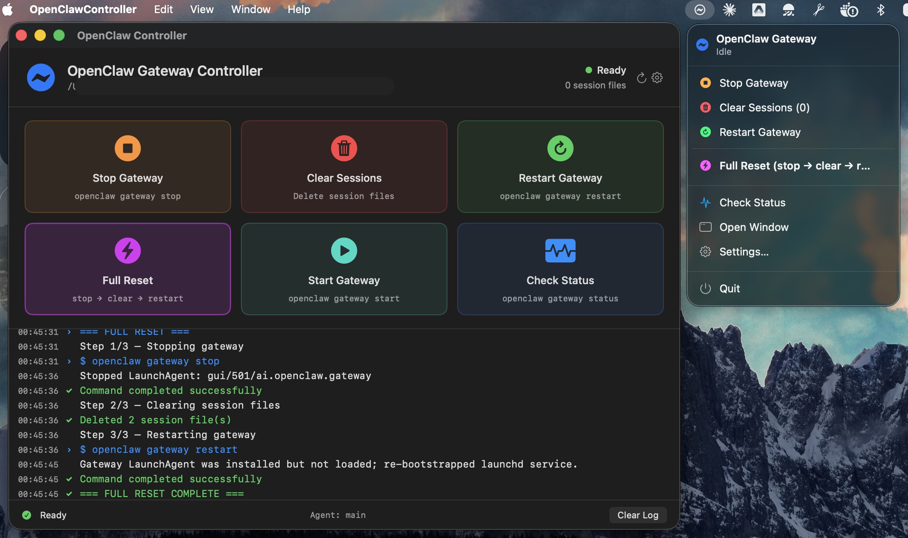

# OpenClaw Controller

A native macOS menu bar app for managing your [OpenClaw](https://docs.openclaw.ai/) gateway — stop, start, restart, clear sessions, and check status with one click. No terminal required.


---

## Why

If you use OpenClaw, you know the loop: edit config, stop the gateway, delete session files, restart the gateway, repeat. This app puts that entire cycle behind a single button.

## Features

- **Menu bar icon** — always accessible, click for a compact popover with all actions
- **Full Reset** — stop gateway, clear session files, restart gateway in one click
- **Individual controls** — stop, start, restart, check status separately
- **Session cleaner** — shows session file count badge, wipes them on demand
- **Live log** — color-coded command output with timestamps
- **First-run setup wizard** — auto-detects your `openclaw` binary and sessions directory
- **Settings** — change paths, switch agents, re-run setup anytime
- **Native SwiftUI** — lightweight, fast, no Electron, no dependencies

## Screenshot



## Requirements

- **macOS 14** (Sonoma) or later
- **OpenClaw** installed and available ([installation guide](https://docs.openclaw.ai/getting-started/installation))
- **Xcode Command Line Tools** (`xcode-select --install`)

## Install

### Option 1: One-liner

```sh
curl -fsSL https://raw.githubusercontent.com/eljazira/openclaw-controller/main/install.sh | bash
```

> After downloading, update the URL above with your actual GitHub username.

### Option 2: Build from source

```sh
git clone https://github.com/eljazira/openclaw-controller.git
cd openclaw-controller
./build.sh
open OpenClawController.app
```

### Option 3: Download from Releases

Download the latest `.app.zip` from the [Releases](https://github.com/eljazira/openclaw-controller/releases) page, unzip, and drag to `/Applications`.

### Move to Applications (recommended)

```sh
mv OpenClawController.app /Applications/
open -a OpenClawController
```

### Auto-launch on login

System Settings → General → Login Items & Extensions → click **+** under "Open at Login" → select **OpenClawController**.

## First Launch

On first launch, the **Setup Wizard** walks you through:

1. **Detect OpenClaw** — auto-finds the `openclaw` binary (checks `/opt/homebrew/bin`, `/usr/local/bin`, your PATH). You can also browse manually.
2. **Configure Sessions** — picks the right sessions directory and agent. Defaults to `~/.openclaw/agents/main/sessions`.
3. **Test Connectivity** — runs `openclaw gateway status` to verify everything works.

After setup, the app lives in your **menu bar** (look for the ⚡ bolt icon in the top-right of your screen).

## Usage

### Menu Bar (quick access)

Click the ⚡ icon to open the popover:

| Button | What it does |
|---|---|
| **Stop Gateway** | `openclaw gateway stop` |
| **Clear Sessions (N)** | Deletes all `.jsonl` files in the sessions directory |
| **Restart Gateway** | `openclaw gateway restart` |
| **Full Reset** | stop → clear sessions → restart (all in sequence) |
| **Check Status** | `openclaw gateway status` (read-only, safe) |
| **Open Window** | Opens the detailed main window |
| **Settings** | Change paths, agents, or re-run setup |

### Main Window (detailed view)

The window shows the same controls as large action cards plus a **live log** panel with color-coded output:

- 🔵 Blue — commands being run
- 🟢 Green — success
- 🔴 Red — errors
- 🟠 Orange — warnings
- ⚪ Default — informational output

## Configuration

All settings are stored in macOS user defaults (`UserDefaults.standard`) and persist across launches.

| Setting | Default | Description |
|---|---|---|
| `openclawPath` | Auto-detected | Full path to the `openclaw` binary |
| `sessionsPath` | `~/.openclaw/agents/{agent}/sessions` | Directory containing session `.jsonl` files |
| `agentName` | `main` | Which agent's sessions to manage |

You can change these anytime via **Settings** in the menu bar popover or the gear icon in the main window.

## Building from Source

### Prerequisites

```sh
# Install Xcode Command Line Tools (if not already installed)
xcode-select --install

# Verify Swift is available
swift --version
```

### Build

```sh
./build.sh
```

This runs `swift build -c release` and packages the binary into `OpenClawController.app` with a proper `Info.plist`.

### Rebuild after changes

```sh
./build.sh && killall OpenClawController 2>/dev/null; open OpenClawController.app
```

### Clean build

```sh
rm -rf .build && ./build.sh
```

## Project Structure

```
├── Package.swift                        # Swift Package manifest (macOS 14+)
├── build.sh                             # Build + package into .app bundle
├── install.sh                           # One-liner install script
├── Sources/OpenClawController/
│   ├── App.swift                        # Entry point, MenuBarExtra + Window scenes
│   ├── AppSettings.swift                # Configuration with auto-detection + persistence
│   ├── GatewayController.swift          # Business logic (runs commands, manages state)
│   ├── SetupWizardView.swift            # First-run onboarding wizard
│   ├── SettingsView.swift               # Post-setup configuration UI
│   ├── MenuBarContentView.swift         # Menu bar popover UI
│   └── MainWindowView.swift             # Main window with action cards + log
├── README.md
├── CONTRIBUTING.md
├── LICENSE
└── DEVELOPER_NOTES.md                   # In-depth architecture + cookbook for contributors
```

## FAQ

**Q: I don't see the menu bar icon.**
A: It may be hidden behind the notch on MacBook Pro/Air. Try ⌘-dragging other menu bar icons to make room. Or open the app from the dock/Spotlight first.

**Q: "Cannot be opened because the developer cannot be verified"**
A: The app is not code-signed or notarized. Right-click the `.app` → Open → click Open in the dialog. You only need to do this once.

**Q: The gateway commands fail with "not found"**
A: Open Settings and verify the OpenClaw binary path. Click "Detect" to re-scan. Make sure OpenClaw is installed (`brew install openclaw` or see [OpenClaw docs](https://docs.openclaw.ai/getting-started/installation)).

**Q: Can I manage multiple agents?**
A: Yes — open Settings and change the agent name. The app manages one agent at a time. To switch, just change the agent in settings.

**Q: Does this work with `--dev` mode / profiles?**
A: Set a custom sessions path in Settings that points to your dev/profile sessions directory (e.g., `~/.openclaw-dev/agents/main/sessions`).

## Contributing

See [CONTRIBUTING.md](CONTRIBUTING.md) for guidelines.

## License

[MIT](LICENSE) — use it, fork it, build on it.

## Acknowledgments

Built with [Claude Code](https://claude.ai/claude-code) by Anthropic.
Designed for the [OpenClaw](https://openclaw.ai/) community.
